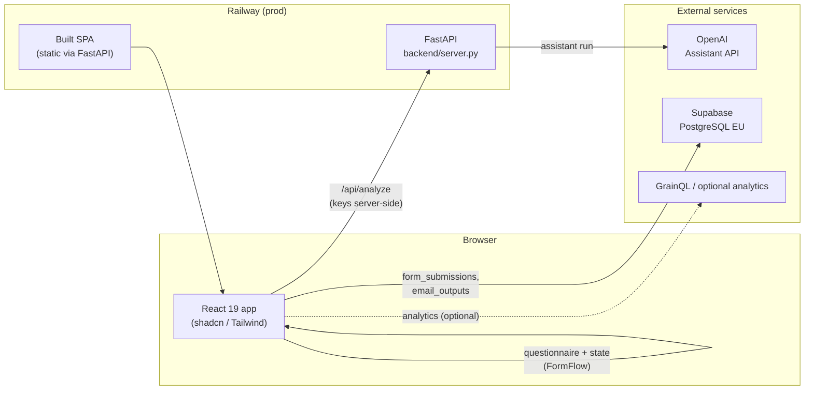
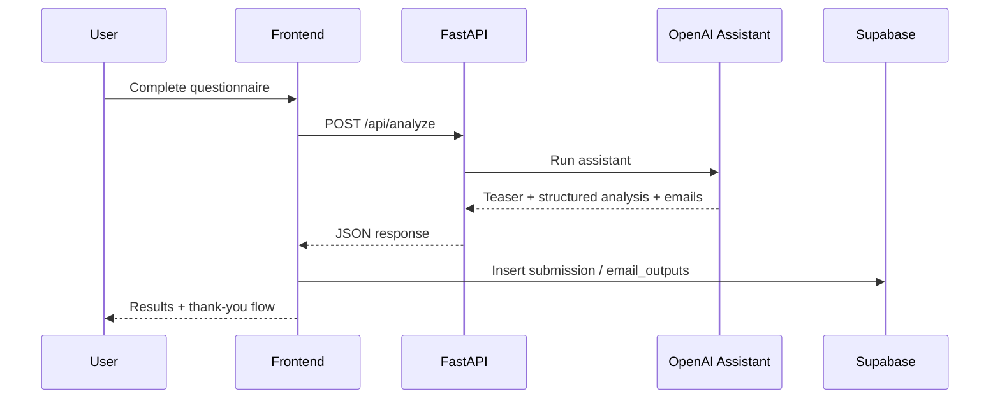
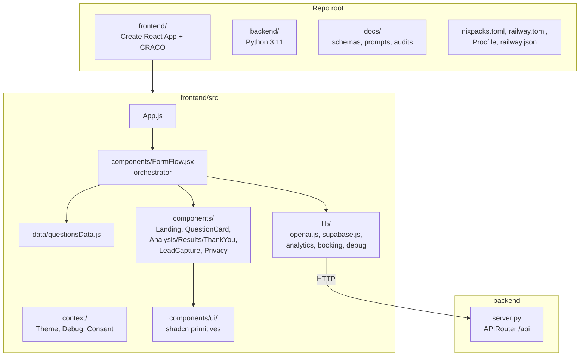
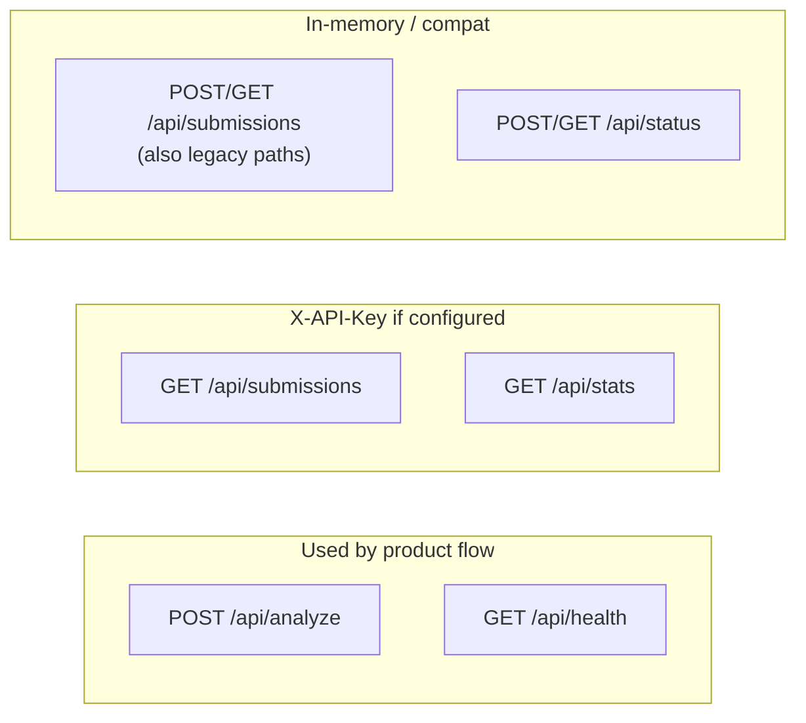

# Codebase architecture (diagrams)

Visual overview of **ypsys-nlpd-form-emergent**: nLPD compliance self-assessment form (React + FastAPI + Supabase + OpenAI Assistant), deployed on Railway.

For narrative detail, see `AGENTS.md` and `README.md`.

## Runtime architecture (data & services)

## Request flow (happy path)

## Repository layout (main pieces)

## Backend API surface (orientation)

